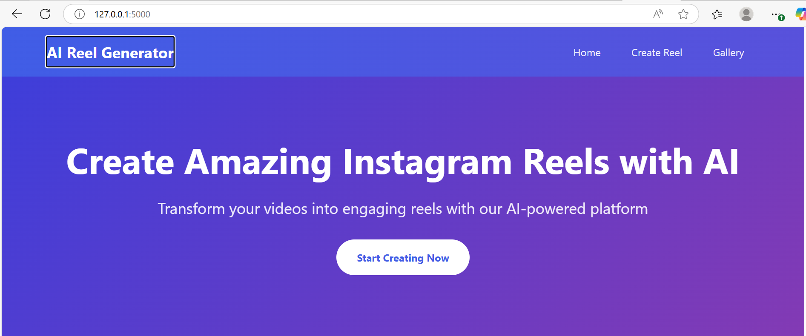
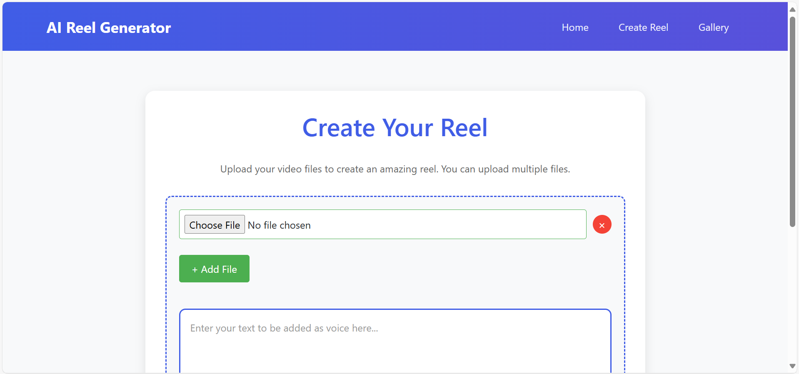
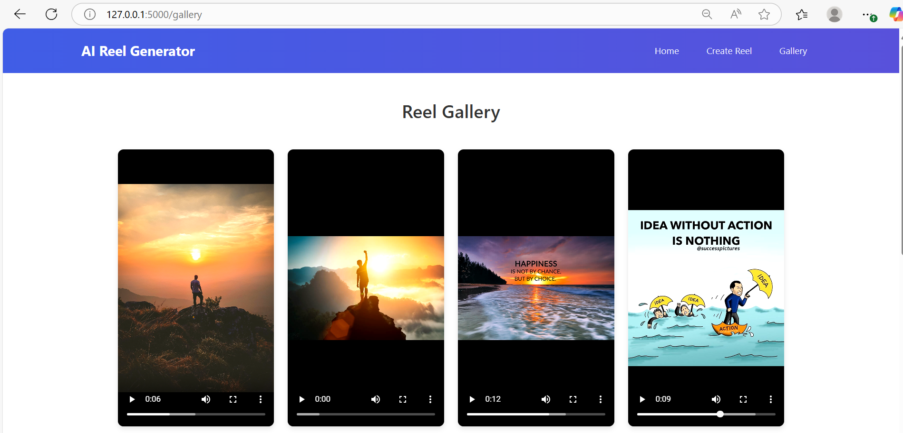

# AI Reel Generator

## Overview

The **AI Reel Generator** allows users to upload video files and create Instagram-style reels using AI. This app enables the user to transform videos into engaging and shareable content by adding voice, filters, and more. The gallery displays the created reels in a neat and responsive grid.

## Features

- **Video Upload**: Upload multiple video files to create Instagram reels.
- **AI-powered Customization**: Enhance your videos with AI.
- **Responsive Gallery**: The gallery showcases the generated reels in a responsive grid layout, perfect for any device.
- **Video Playback**: Users can play and view their created reels directly in the gallery.

## Screenshots

### 1. Home Page

The home page introduces the app with a clean and minimal design. It features the app name, a call-to-action button for creating reels, and a brief description of the platform's purpose.



---

### 2. Create Reel Page

The Create Reel page allows users to upload their video files and enter text that will be used as a voiceover for their reel. Users can upload multiple files at once and customize their video.



---

### 3. Reel Gallery

Once the user has created their reels, they can view them in the **Reel Gallery**. The gallery is presented in a neat grid layout, with each video displayed in individual tiles. Users can play the videos and watch them directly in the gallery.



---

## Technologies Used

- **Frontend**: HTML, CSS, JavaScript
- **Backend**: Python (Flask)
- **AI**: TensorFlow/PyTorch (for AI-powered enhancements)
- **File Upload**: Flask File Uploads

## Setup

1. Clone the repository:

   ```bash
   git clone https://github.com/yourusername/AI-Reel-Generator.git
